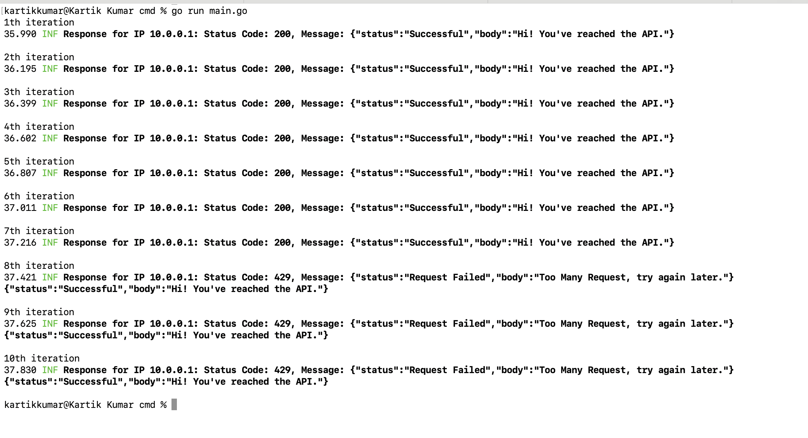
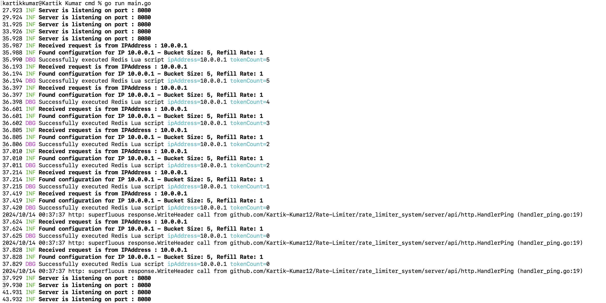
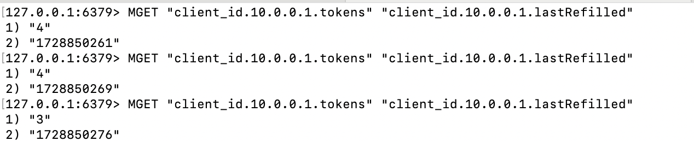

# Rate Limiter System

## Overview

The Rate Limiter system is designed to control the rate of incoming requests from clients based on their IP addresses. It implements the **Token Bucket Algorithm** for rate limiting and uses **Redis** as a backend store to ensure scalability and persistence of rate-limiting data across distributed environments.


## Table of Contents

- [Project Structure](#project-structure)
- [Setup](#setup)
- [Running the System](#running-the-system)
- [Key Components](#key-components)
- [High-Level Workflow](#high-level-workflow)
- [Token Bucket Algorithm Flow with Example Output](#token-bucket-algorithm-flow-with-example-output)
- [Debugging with VSCode](#debugging-with-vscode)
- [License](#license)

## Project Structure

```
.
├── client/              # Client package for sending test requests
│   ├── cmd/
│   ├── config/
│   ├── services/
│   ├── structs/
│   └── main.go          # Entry point for client execution
├── server/              # Server package with rate limiter logic
│   ├── api/
│   ├── cmd/
│   ├── config/
│   ├── middleware/
│   ├── store/
│   └── main.go          # Entry point for server execution
├── .vscode/             # VSCode folder for debugging configurations
│   └── launch.json      # Debugging configurations for server and client
├── go.mod
├── go.sum
└── LICENSE
```

## Setup

### Prerequisites

- [Go](https://golang.org/doc/install) 1.17 or higher
- Redis (version 6.x or higher)

### Redis Setup

To install and run Redis on your system:

```bash
# On macOS
brew install redis
redis-server
```

Make sure Redis is running on `localhost:6379`.

### Running the Server

To start the server:

```bash
cd server/
go run main.go
```

The server will start and listen for incoming requests on port `8080`.

### Running the Client

To simulate sequential or concurrent requests from the client:

```bash
cd client/
go run main.go
```

We can modify the client logic to send sequential or concurrent requests by editing `client/main.go`.

## Key Components:
1. **Token Bucket Algorithm**: 
   - Each IP address is associated with a "bucket" of tokens. Every request consumes one token. If the bucket is empty (i.e., no tokens are available), the request is rate-limited and rejected.
   - The bucket refills tokens at a predefined rate, allowing future requests after a certain amount of time has passed.
   - This mechanism ensures fair usage, preventing individual clients from overwhelming the server with too many requests.

2. **Redis as a Backend Store**:
   - **Why Redis?**
     - Redis is used as a highly efficient, in-memory data store to keep track of token counts and the last refill time for each IP address.
     - Redis ensures **persistence** and **scalability**. In scenarios where the server is running in a distributed environment (e.g., multiple server instances behind a load balancer), Redis acts as a shared store, allowing rate-limiting to work consistently across all server instances.
   - **How Redis is Used**:
     - For each IP, Redis stores:
       - **Token Count**: The current number of tokens available in the bucket.
       - **Last Refill Time**: The last time tokens were added to the bucket.
     - A Lua script is used within Redis to efficiently manage token refill and consumption in one atomic operation, ensuring consistency even under heavy load.
   - Redis is chosen for its low-latency read/write operations, which is crucial for a rate limiter where each request needs to quickly access and update token data.

3. **Server**:
   - The server handles incoming requests and checks if the requesting IP is within its allowed rate limit.
   - If the client has sufficient tokens, the request is processed; otherwise, the server responds with a `429 Too Many Requests` error.

4. **Client**:
   - The client simulates API requests to the server to test the rate limiter’s behavior. It can be configured to send requests sequentially (one after the other) or concurrently (in parallel), allowing you to test how the system handles varying load patterns.


## High-Level Workflow

1. **Client Makes a Request**:
   - The client reads a list of IP addresses from the `config/ip_address.json` file.
   - Depending on the configuration, the client sends either **sequential** or **concurrent** HTTP requests to the server’s `/ping` endpoint using the IPs from the configuration.

2. **Server Receives the Request**:
   - When a request is received, the server’s **rate limiter middleware** extracts the client's IP address from the request parameters (e.g., `/ping?ip=10.0.0.1`).
   - The middleware determines whether the client is allowed to make the request based on its rate limit.

3. **Rate Limiting Check (Redis Interaction)**:
   - The server interacts with **Redis**, where it stores rate-limiting data such as:
     - **Token Count**: How many tokens (requests) the client is allowed to make.
     - **Last Refill Time**: When the tokens were last added to the bucket for the IP.
   - The server checks Redis to retrieve the current **token count** and **last refill time** for the client’s IP address.
   - The **Token Bucket Algorithm** is applied:
     - If sufficient time has passed since the last refill, tokens are added to the bucket at the defined **refill rate** (tokens per second).
     - The token bucket’s **capacity** (maximum number of tokens) ensures that no more tokens are added than allowed for each IP.

4. **Token Availability Check**:
   - If there are **tokens available** in the bucket:
     - One token is consumed from the bucket.
     - The server allows the request to proceed and responds with a **200 OK** status along with a success message.
     ```json
     {
       "Status": "Successful",
       "Body": "Hi! You've reached the API."
     }
     ```
   - If **no tokens are available** in the bucket:
     - The request is rejected by the server.
     - The server responds with an HTTP **429 Too Many Requests** status along with an error message.
     ```json
     {
       "Status": "Request Failed",
       "Body": "Too Many Requests, try again later."
     }
     ```

5. **Updating Redis**:
   - After processing the request (either accepting or rejecting it), Redis is updated with the new **token count** and **last refill time**:
     - If a token was consumed, the count is decremented.
     - The **last refill time** is set to the current time for future requests.

6. **Client Receives the Response**:
   - The client logs the server’s response, which includes:
     - The **HTTP status code** (either `200 OK` for successful requests or `429 Too Many Requests` for rate-limited requests).
     - The **body message** that details whether the request was successful or rate-limited.


## Token Bucket Algorithm Flow with Example Output

The **Token Bucket** algorithm allows requests up to a certain capacity, refilling tokens at a fixed rate. Each request consumes one token, and requests are permitted as long as there are enough tokens available. If no tokens are available, the request is denied.

### Example Configuration:
- **Bucket Capacity**: 5 tokens
- **Refill Rate**: 1 token per second

### Example Output Breakdown:

#### **Client Events:**
The client makes several HTTP requests to the server's `/ping` endpoint. For each request, the client logs the server’s response:




- **Requests 1 to 6**: The server responds with **200 OK**, meaning the request was allowed.
- **Requests 7 to 10**: The server responds with **429 Too Many Requests**, indicating the rate limit was exceeded and the bucket was empty.

#### **Server Events:**
The server logs how it processes each request and manages tokens for the client’s IP. The server interacts with **Redis** to update and check the token count for the client's IP:




- The server logs show the token count for each IP and whether the Lua script executed successfully to manage the tokens.
- As the tokens are consumed, the **tokenCount** decreases until it reaches 0, after which the server starts rejecting requests.

#### **Redis Events:**
Redis stores the current token count and the last time tokens were refilled for each IP. The Redis output verifies the token consumption and refill:




The **Redis output** provides insight into how many tokens are left and when the tokens were last refilled.

---

### **Detailed Token Flow:**

Here’s a step-by-step breakdown of token consumption and refill during the client-server interaction:

1. **Request 1 at 31.532 seconds**:
   - **Tokens before the request**: 5
   - **Tokens added**: 0.0 (no refill since the last request)
   - **Total tokens after addition**: 5.0
   - **Tokens left after request**: 4.0 (1 token consumed)

2. **Request 2 at 31.734 seconds**:
   - **Tokens before the request**: 4
   - **Tokens added**: 0.2 (slight refill due to elapsed time)
   - **Total tokens after addition**: 4.2
   - **Tokens left after request**: 3.2 (1 token consumed)

3. **Request 3 at 32.739 seconds**:
   - **Tokens before the request**: 3.2
   - **Tokens added**: 0.8 (more time passed, more tokens refilled)
   - **Total tokens after addition**: 4.0
   - **Tokens left after request**: 3.0 (1 token consumed)

4. **Request 4 at 32.739 seconds**:
   - **Tokens before the request**: 3
   - **Tokens added**: 0.2
   - **Total tokens after addition**: 3.2
   - **Tokens left after request**: 2.2

5. **Request 7 at 33.739 seconds (Denied)**:
   - **Tokens before the request**: 0.0
   - **Tokens added**: 0.2
   - **Total tokens after addition**: 0.2
   - **Tokens left after request**: 0.2 (Request denied due to insufficient tokens)

### **How the Components Work Together**:

1. **Client**:
   - Sends requests sequentially or concurrently to test the rate-limiting behavior.
   - Receives a response indicating if the request was successful (200 OK) or rate-limited (429 Too Many Requests).
   
2. **Server**:
   - Applies the **Token Bucket Algorithm** and interacts with Redis to check if there are enough tokens for the client's IP.
   - Logs each request and token consumption to help track the rate-limiting status.
   - Uses a Lua script to update the token count and last refill time atomically in Redis.

3. **Redis**:
   - Stores the current token count and last refill time for each IP.
   - The **MGET** command allows inspecting the token count and refill time directly for verification purposes.
   - Ensures that the server can check the token count in real-time and handle token consumption consistently across distributed instances.

### **Verifying Redis Tokens and Refill Time**:

To inspect the token count and last refill time, you can query Redis using:

```bash
MGET "client_id.<ip_address>.tokens" "client_id.<ip_address>.lastRefilled"
```

This will show the current token count and the last time tokens were refilled. By increasing the sleep time in the client program, you can observe the token refill in real-time as the client makes requests.


## Debugging with VSCode

This project includes a `.vscode/launch.json` file for convenient debugging of both the client and server using VSCode.

### VSCode Debugging Configuration

```json
{
    "version": "0.2.0",
    "configurations": [
      {
        "name": "Local Client",               
        "type": "go",
        "request": "launch",
        "mode": "auto",
        "program": "${workspaceFolder}/rate_limiter_system/client/cmd",  
        "env": {},
        "args": [],
        "cwd": "${workspaceFolder}/rate_limiter_system/client/cmd"
      },
      {
        "name": "Local Server",               
        "type": "go",
        "request": "launch",
        "mode": "auto",
        "program": "${workspaceFolder}/rate_limiter_system/server/cmd",  
        "env": {},
        "args": [],
        "cwd": "${workspaceFolder}/rate_limiter_system/server/cmd"
      }
    ]
}
```

- **Local Client**: Configuration for debugging the client. It sets the working directory and path to the `main.go` file inside the `client/cmd` folder.
- **Local Server**: Configuration for debugging the server. It sets the working directory and path to the `main.go` file inside the `server/cmd` folder.

To debug:
1. Open VSCode.
2. Navigate to the "Run and Debug" tab.
3. Choose either the **Local Client** or **Local Server** configuration, and click "Start Debugging".

## License
This project is open-source and available under the [MIT License](LICENSE).

